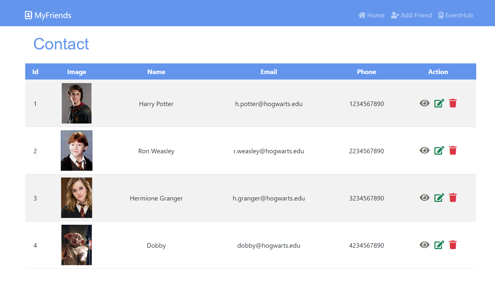

# MyFriends App

MyFriends is a friend list application built on Node.js and Express, using Bootstrap and Font Awesome for the frontend. This app allows users to manage their friends contact and info, record their memory events, and view a centralized event hub.

## Features

- **Home Page:**
  - View a list of friends with contact info such as name, email, and phone.
  - Click the eye icon to open a detailed friend page.
  - Add, edit, and delete friends.
- **Friend Page:**

  - View a friend detailed info including address, date of birth, favorite things.
  - Click the button to update this friend's info
  - Check your memory events with this friend. (Edit and Delete function will be developed later)
  - Add new memory events for this friend. (Will be developed later)

- **Event Hub:**

  - View all events in a centralized event hub.
  - Filter events based on friend name.
  - (will create add event function later)
  - Click on the event name will lead you to the Event Page

- **Event Pages:**
  - View detailed information about a specific event.
  - Add comments to events.

## Preview

## Dependencies Installed

- Node.js
- Express
- EJS

## Installation

1. Clone the repository.
2. Run `npm install` to install dependencies.
3. Start the application with `npm run dev`.

## Usage

- Access the home page to view and manage your friends.
- Navigate to the event hub to view and filter memory events.
- Explore individual friend pages for detailed information and events.
- Add new friends, memory events, and comments as needed.

## Data Categories

The app includes three main data categories: `friends`, `events`, and `comments`.

## Routes

- `/`: Home page displaying a list of friends.
- `/add`: Add friend page.
- `/eventhub`: Event hub displaying all events with filtering options (using friendId as the query parameter).
- `/api/friends/:id`: Individual friend page with options to view (GET), update (PATCH) and delete (DELETE).
- `/api/events/:id`: to populate Individual event page.

## Custom Middleware

The application includes two custom middleware to handle errors in `app.js` and `/utilit/error.js`.

## Template Views

The app uses EJS templates to render pages with dynamic content. Key templates include:

- `index.ejs`: Home page template.
- `friendPage.ejs`: Individual friend page template.
- `updateFriend.ejs`: Update friend page template.
- `addFriend.ejs`: Add friend page template.
- `eventHub.ejs`: Event hub page template.
- `eventPage.ejs`: Individual event page template.
